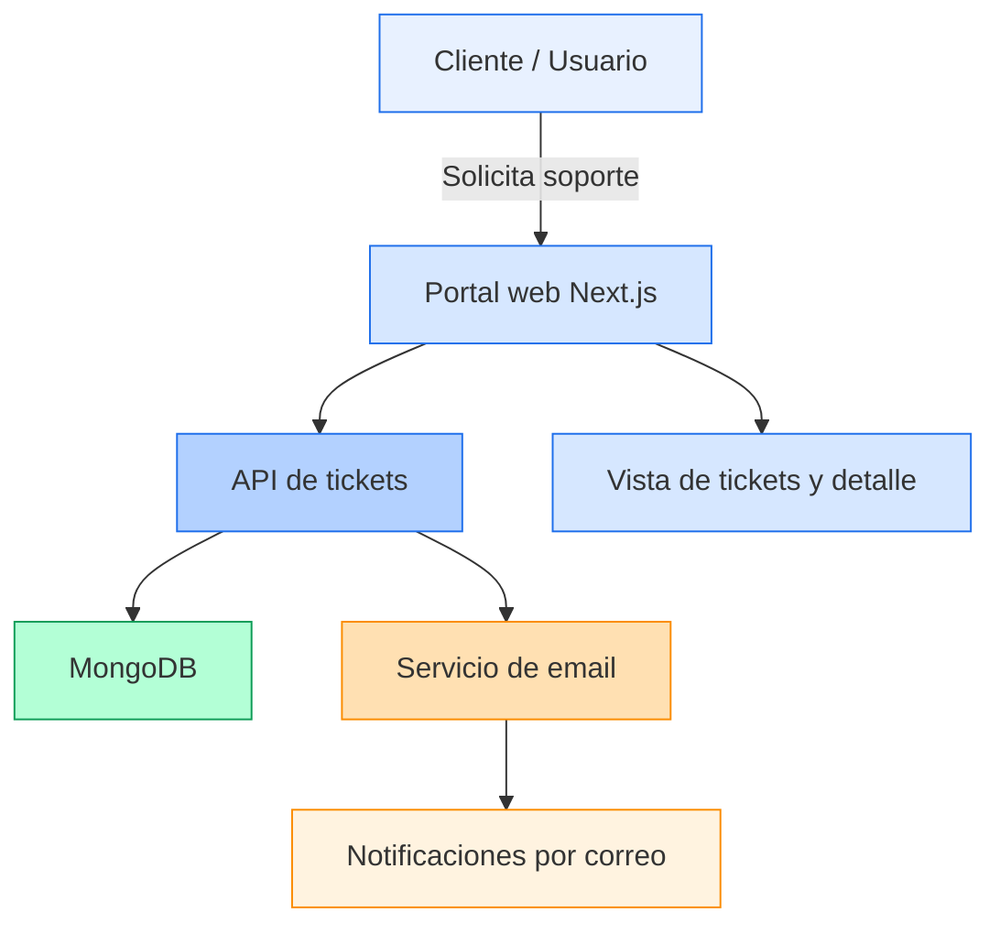
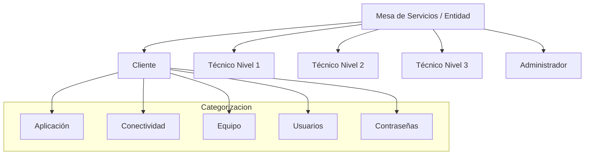
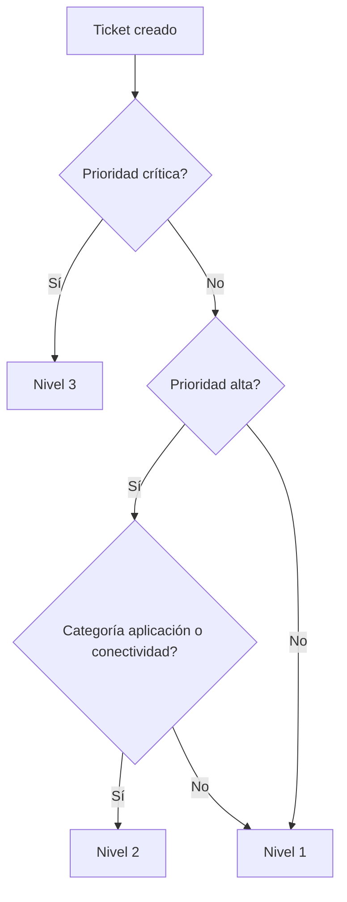
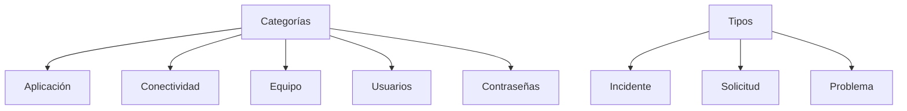
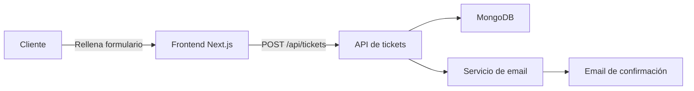
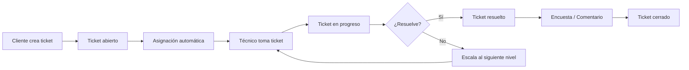
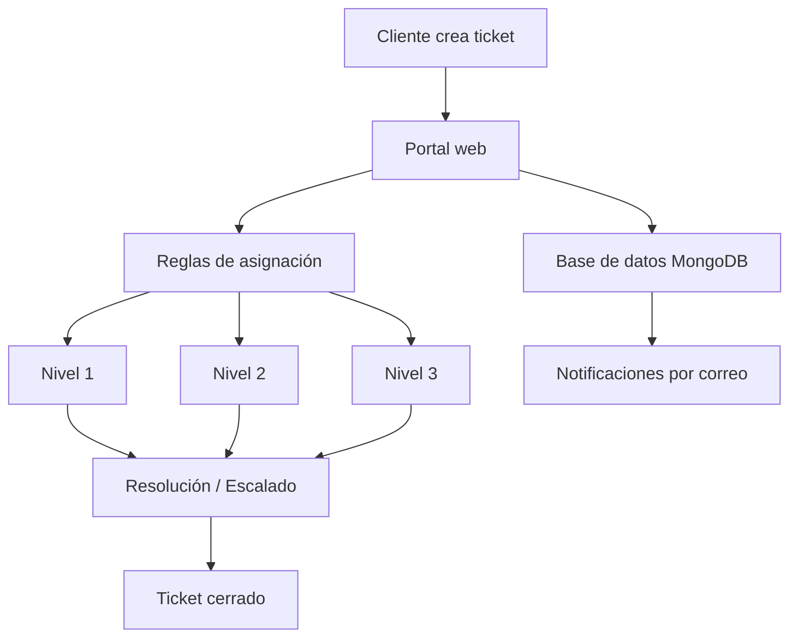

# Diseño de la Mesa de Servicios

## 1. Visión general del servicio

Este proyecto implementa una Mesa de Servicios a medida, construida sobre un portal web propio. No se utilizó una solución estándar como Odoo, GLPI o Salesforce. En su lugar, se desarrolló una aplicación personalizada con:

- Frontend en **Next.js** + **React**
- Backend serverless/API con **Next.js App Router**
- Base de datos **MongoDB** con **Mongoose**
- Autenticación con sesión por cookie
- Notificaciones por correo electrónico usando un servicio de email personalizado

## Diagrama del portal de Mesa de Servicios



## 2. Configuración técnica de la mesa de servicios

### 2.1 Tecnologías principales

- **Next.js**: framework React para construir páginas, rutas y API.
- **React**: interfaz interactiva para crear y actualizar tickets.
- **TypeScript**: tipado estático para mejorar calidad y seguridad del código.
- **MongoDB**: almacena tickets, usuarios, comentarios y escalados.
- **Mongoose**: modela los datos, define esquemas y gestiona validaciones.
- **Emails**: envíos automáticos cuando se crea, asigna, escala o resuelve un ticket.

### 2.2 Proceso de configuración

1. Conectar la aplicación a MongoDB usando `lib/mongodb.ts`.
2. Definir los modelos de datos:
   - Usuarios: `lib/models/user.ts`
   - Tickets: `lib/models/ticket.ts`
3. Crear rutas API para tickets:
   - `app/api/tickets/route.ts` (listar y crear)
   - `app/api/tickets/[id]/route.ts` (ver y actualizar)
4. Desarrollar formulario de creación y vistas de detalle.
5. Agregar lógica de reglas de asignación y escalado en el backend.
6. Enviar notificaciones por correo desde `lib/email.ts`.

## Diagrama de arquitectura técnica

```mermaid
flowchart LR
  subgraph Frontend
    A[Next.js + React] --> B[Formulario de ticket]
    A --> C[Tablero de tickets]
  end
  subgraph Backend
    D[API routes] --> E[`app/api/tickets/route.ts`]
    D --> F[`app/api/tickets/[id]/route.ts`]
    D --> G[`lib/email.ts`]
    D --> H[`lib/models/ticket.ts`]
    D --> I[`lib/models/user.ts`]
  end
  E --> J[MongoDB]
  F --> J
  G --> K[Email provider]
  H --> J
  I --> J
  style J fill:#B3FFD6,stroke:#0F9D58
  style K fill:#FFE0B2,stroke:#FB8C00
```

## 3. Creación de entidad y grupos

### 3.1 Entidad principal

La entidad principal es la propia Mesa de Servicios del proyecto, asumida como la empresa o unidad de servicio. No existe una tabla específica de “empresa”; la organización se modela mediante los usuarios y sus roles.

### 3.2 Grupos y niveles de soporte

Se representan como roles y niveles de técnico:

- `cliente`: usuario que crea tickets.
- `tecnico_n1`: soporte nivel 1.
- `tecnico_n2`: soporte nivel 2.
- `tecnico_n3`: soporte nivel 3.
- `admin`: administrador con acceso completo.

La agrupación lógica se puede considerar así:

- Soporte hardware / software / red: definido por categorías del ticket.
- Niveles de escalado: `tecnico_n1`, `tecnico_n2`, `tecnico_n3`.

## Diagrama de grupos y niveles de soporte



## 4. Reglas de asignación

El sistema incluye reglas básicas para asignar el ticket al nivel adecuado en función de la prioridad y categoría.

En el backend se usa la función `resolveAssignedLevel` de `app/api/tickets/route.ts`.

Reglas principales:

- Si la prioridad es `critica` → asignar a `tecnico_n3`.
- Si la prioridad es `alta` y la categoría es de aplicación o red → asignar a `tecnico_n2`.
- En cualquier otro caso → asignar a `tecnico_n1`.

Ejemplo adaptado a la pregunta:

- Si la categoría es “Error de red” (`conectividad`) y la prioridad es `alta`, el ticket se envía a **Nivel 2**.

## Diagrama de reglas de asignación



## 5. Definición de categorías de tickets

El modelo define las siguientes categorías y tipos:

### Categorías de tickets

- `aplicacion`
- `conectividad`
- `equipo`
- `usuarios`
- `contrasenas`

### Tipos de ticket

- `incidente`
- `solicitud`
- `problema`

Estas categorías se usan en el formulario de creación y en la lógica de reportes.

## Diagrama de categorías y tipos de ticket



## 6. Creación, actualización y gestión de tickets

### 6.1 Creación

El formulario de creación está en `components/ticket-form.tsx`.

Flujo:

1. El cliente completa título, descripción, tipo, categoría y prioridad.
2. El frontend envía un `POST` a `/api/tickets`.
3. El backend genera un número de ticket, calcula el SLA y asigna el nivel inicial.
4. Se guarda el ticket en MongoDB.
5. Se envía un correo de confirmación al creador.

## Diagrama de creación de ticket



### 6.2 Actualización y gestión

El endpoint `PATCH /api/tickets/[id]` permite varias acciones:

- `assign`: tomar el ticket por un técnico.
- `escalate`: subir el ticket al siguiente nivel.
- `resolve`: marcar como resuelto.
- `close`: cerrar el ticket.
- `comment`: agregar comentario interno o externo.
- `survey`: cliente envía evaluación y cierra el ticket.
- `updateStatus`: cambiar estado.
- `updateType`: cambiar tipo de ticket.

### 6.3 Estados del ticket

Los estados definidos son:

- `abierto`
- `en_progreso`
- `pendiente`
- `escalado`
- `resuelto`
- `cerrado`

### 6.4 Flujo de gestión

1. Cliente crea el ticket.
2. El sistema lo asigna a un nivel de soporte.
3. Técnico toma el ticket y pasa a `en_progreso`.
4. Si es necesario, el técnico lo escala a nivel superior.
5. Cuando está resuelto, el técnico marca el ticket como `resuelto`.
6. El cliente puede enviar una encuesta de satisfacción y cerrar el ticket.

## Diagrama de flujo de gestión de tickets



## 7. Resumen del diseño del servicio

- Se creó una mesa de servicios a medida, no se utilizó software comercial.
- La aplicación es una solución web propia con Next.js, MongoDB y Mongoose.
- Los roles de usuario modelan la estructura de soporte y niveles.
- Las reglas de asignación son automáticas según prioridad y categoría.
- La gestión de tickets cubre creación, asignación, escalado, resolución, comentarios y cierre.
- El proyecto también incluye notificaciones por correo para mantener informados a clientes y técnicos.

## Diagrama resumen del servicio



